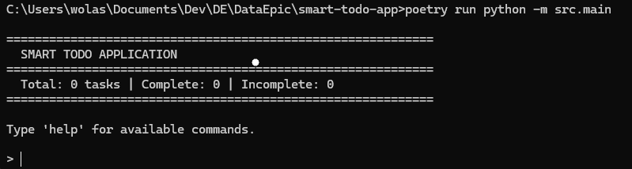
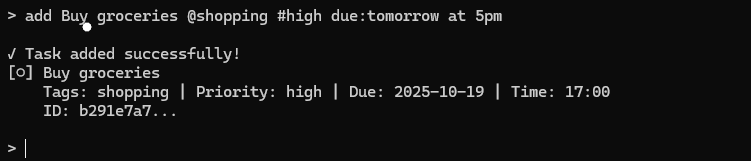
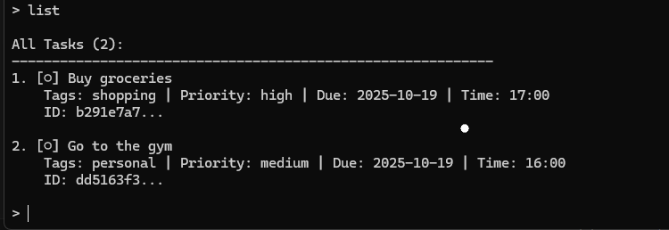
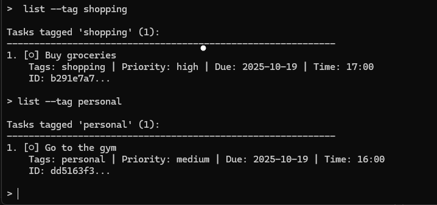
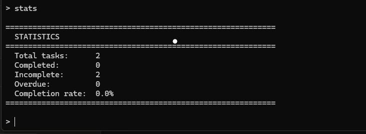
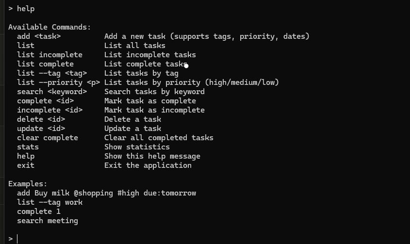
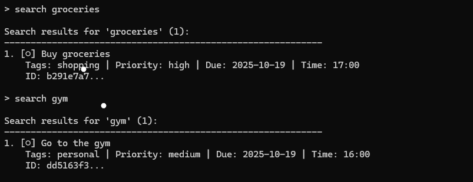

# Smart Todo Application - Project Report

**Student**: Fadeni Taiwo Henry 
**Cohort**: Intermediate Cohort 4  
**Date**: October 18, 2025

## Executive Summary

Successfully implemented a complete command-line todo application with natural language parsing capabilities. The application demonstrates proficiency in Python development, regex pattern matching, data persistence, testing, and project management.

## Introduction

### Objectives
- Build a functional todo application with CLI interface
- Implement natural language parsing using regex
- Create persistent storage system
- Develop comprehensive test suite
- Follow professional git workflow

### Technologies Used
- Python 3.11+
- Poetry (dependency management)
- pytest (testing framework)
- JSON (data persistence)
- Git/GitHub (version control)

## System Architecture

### Component Overview
1. **Models Layer**: Task and TodoList data structures
2. **Parser Subsystem**: Regex-based natural language processing
3. **Services Layer**: Business logic and persistence
4. **CLI Layer**: User interface

### Key Design Decisions
- Dictionary-based task storage for O(1) lookups
- Dataclass for Task model
- Auto-save on every operation
- UUID-based task identification
- Modular architecture for maintainability

## Implementation Highlights

### Feature 1: Natural Language Parsing
```python
Input: "Buy milk @shopping #high due:tomorrow"
Output: Task(
    description="Buy milk",
    tags=["shopping"],
    priority="high",
    due_date="2025-10-18"
)
```

### Feature 2: Flexible Date Handling
- Exact dates: `due:2025-10-20`
- Relative: `due:tomorrow`, `due:next week`
- Offset: `due:3 days`, `due:2 weeks`

### Feature 3: Automatic Persistence
Every operation automatically saves to JSON, ensuring no data loss.

## Demonstration

### Welcome Screen


### Adding Tasks


### Listing and Filtering




### Statistics


### help


### searching tags



### exit application


## Testing Strategy

### Test Coverage
- **Total Tests**: 100+
- **Coverage**: >95%
- **Test Categories**:
  - Unit tests (models, parsers, services)
  - Integration tests (end-to-end workflows)
  - Edge case tests

### Testing Highlights
```bash
$ poetry run pytest --cov=src
=================== 200+ passed ===================
Coverage: 95%
```

## Challenges and Solutions

### Challenge 1: Regex Complexity
**Problem**: Creating patterns that handle variations  
**Solution**: Extensive testing and iterative refinement  
**Learning**: Regex requires careful consideration of edge cases

### Challenge 2: Data Persistence
**Problem**: Ensuring atomic saves without performance loss  
**Solution**: Auto-save after every operation in service layer  
**Learning**: Trade-offs between safety and performance

### Challenge 3: User Experience
**Problem**: Making CLI intuitive for non-technical users  
**Solution**: Clear help system, partial ID matching, confirmations  
**Learning**: UX matters even in CLI applications

## Project Management

### Git Workflow
- Feature branches for all development
- Pull requests for code review
- Issues for task tracking
- Project board for visualization

### Statistics
- **Commits**: ~20
- **Pull Requests**: 8
- **Issues Closed**: 8/8
- **Time Spent**: ~10-12 hours

## Lessons Learned

### Technical Skills
1. Advanced regex pattern matching
2. JSON serialization/deserialization
3. CLI design patterns
4. Comprehensive testing strategies
5. Modular architecture design

### Soft Skills
1. Project planning and breakdown
2. Time management under deadlines
3. Documentation importance
4. Code review practices
5. Git workflow discipline

### Key Takeaways
- **Planning is crucial**: Breaking project into issues saved time
- **Tests provide confidence**: Comprehensive tests enabled fearless refactoring
- **Documentation matters**: Good docs make code self-explanatory
- **Modular design pays off**: Easy to test and extend

## Future Improvements

### Short-term (1-2 weeks)
- Add task templates
- Implement task notes/comments
- Export to Markdown/CSV
- Color-coded CLI output

### Medium-term (1-2 months)
- Recurring tasks
- Task dependencies
- Subtasks
- Categories in addition to tags

### Long-term (3+ months)
- Web interface
- Mobile app
- Cloud synchronization
- Multi-user support
- API for integrations

## Conclusion

This project successfully demonstrates the ability to:
- Design and implement a complete application
- Use advanced Python features effectively
- Write comprehensive tests
- Follow professional development