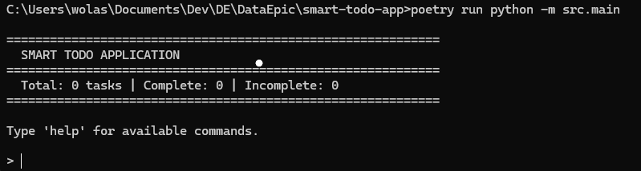
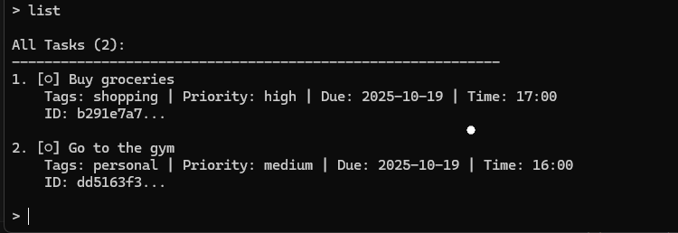
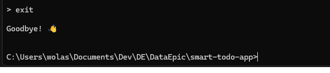

# Smart Todo Application

A powerful command-line todo application with natural language parsing, built with Python. Parse tasks like "Buy milk @shopping #high due:tomorrow" and the app intelligently extracts all components.

## Features

### Core Functionality
- ✅ **Natural Language Parsing** - Add tasks using everyday language
- 🏷️ **Smart Tag System** - Organize with `@work`, `@shopping`, `@personal`
- ⚡ **Priority Levels** - Set importance with `#high`, `#medium`, `#low`
- 📅 **Flexible Dates** - Use exact dates or relative terms like "tomorrow", "next week"
- 👤 **Task Assignment** - Assign tasks via email addresses
- ⏰ **Time Support** - Specify times in 12/24 hour format
- 💾 **Auto-Save** - All changes automatically persist to JSON
- 🔍 **Powerful Search** - Find tasks by keyword, tag, priority, or status
- 📊 **Statistics** - Track completion rates and task metrics

### Technical Features
- Regex-based intelligent parsing
- Comprehensive validation system
- Persistent JSON storage
- Modular architecture
- 200+ unit tests
- >95% code coverage

## Installation

### Prerequisites
- Python 3.10 or higher
- Poetry (dependency management)

### Setup
```bash
# Clone the repository
git clone https://github.com/YOUR-USERNAME/smart-todo-app.git
cd smart-todo-app

# Install dependencies with Poetry
poetry install

# Run the application
poetry run python -m src.main
```

## Usage

### Starting the Application
```bash
poetry run python -m src.main
```

### Available Commands

#### Adding Tasks
```bash
# Simple task
> add Buy milk

# Task with tags
> add Buy milk @shopping @urgent

# Task with priority
> add Complete report #high

# Task with due date (exact)
> add Submit assignment due:2025-10-20

# Task with due date (relative)
> add Call client due:tomorrow
> add Review PR due:next week

# Task with time
> add Team meeting at 3pm @work

# Task with assignment
> add Review code assigned:alice@example.com

# Complete task with all features
> add Buy groceries @shopping #high due:tomorrow at 5pm assigned:john@example.com
```

#### Listing Tasks
```bash
# List all tasks
> list

# List incomplete tasks only
> list incomplete

# List complete tasks only
> list complete

# List by tag
> list --tag work
> list --tag shopping

# List by priority
> list --priority high
> list --priority medium
```

#### Searching Tasks
```bash
# Search by keyword
> search meeting
> search groceries
> search project
```

#### Managing Tasks
```bash
# Mark task as complete (use first few characters of ID)
> complete abc123

# Mark task as incomplete
> incomplete abc123

# Update a task (interactive)
> update abc123

# Delete a task (with confirmation)
> delete abc123
```

#### Utility Commands
```bash
# Show statistics
> stats

# Clear completed tasks
> clear complete

# Show help
> help

# Exit application
> exit
```

### Example Session
```bash
$ poetry run python -m src.main

============================================================
  SMART TODO APPLICATION
============================================================
  Total: 0 tasks | Complete: 0 | Incomplete: 0
============================================================

Type 'help' for available commands.

> add Buy groceries @shopping #high due:tomorrow at 5pm

✓ Task added successfully!
[○] Buy groceries
    Tags: shopping | Priority: high | Due: 2025-10-18 | Time: 17:00
    ID: a1b2c3d4...

> add Review PR @work #medium assigned:alice@example.com

✓ Task added successfully!
[○] Review PR
    Tags: work | Priority: medium | Assigned: alice@example.com
    ID: e5f6g7h8...

> list

All Tasks (2):
------------------------------------------------------------
1. [○] Buy groceries
    Tags: shopping | Priority: high | Due: 2025-10-18 | Time: 17:00
    ID: a1b2c3d4...

2. [○] Review PR
    Tags: work | Priority: medium | Assigned: alice@example.com
    ID: e5f6g7h8...

> complete a1b2

✓ Task marked as complete!

> stats

============================================================
  STATISTICS
============================================================
  Total tasks:      2
  Completed:        1
  Incomplete:       1
  Overdue:          0
  Completion rate:  50.0%
============================================================

> exit

Goodbye! 👋
```
## Screenshots

### Welcome Screen


### Adding a Task
Adding a task with natural language parsing:


### Listing Tasks
View all your tasks at a glance:


### Filtering by Tag
Filter tasks by category:


### Statistics Dashboard
Track your productivity:


### Help Menu
Comprehensive command reference:


### Search Functionality
Quickly find tasks:


### Exit Application
Exit the todo app:



## Project Structure
```
smart-todo-app/
├── src/
│   ├── __init__.py
│   ├── main.py              # Application entry point
│   ├── models/
│   │   ├── __init__.py
│   │   ├── task.py          # Task data model
│   │   └── todo_list.py     # TodoList collection manager
│   ├── parsers/
│   │   ├── __init__.py
│   │   ├── regex_patterns.py # Regex pattern definitions
│   │   ├── task_parser.py    # Main task parser
│   │   ├── date_parser.py    # Date parsing utilities
│   │   └── validator.py      # Validation functions
│   ├── services/
│   │   ├── __init__.py
│   │   ├── task_service.py   # High-level task operations
│   │   └── storage_service.py # JSON persistence
│   └── cli/
│       ├── __init__.py
│       └── interface.py      # Command-line interface
├── tests/
│   ├── __init__.py
│   ├── test_task.py
│   ├── test_todo_list.py
│   ├── test_regex_patterns.py
│   ├── test_task_parser.py
│   ├── test_validator.py
│   ├── test_date_parser.py
│   ├── test_storage_service.py
│   ├── test_task_service.py
│   └── test_cli.py
├── data/
│   └── tasks.json           # Task storage (auto-generated)
├── docs/
│   └── architecture.md      # Architecture documentation
├── pyproject.toml           # Poetry dependencies
├── README.md
├── .gitignore
└── LICENSE
└── PROJECT_REPORT.md
└── Screenshot
```

## Supported Formats

### Tags
- Format: `@tagname`
- Examples: `@work`, `@shopping`, `@personal`, `@urgent`
- Case insensitive
- Alphanumeric with underscores

### Priority Levels
- Format: `#level`
- Levels: `#high`, `#medium`, `#low`
- Case insensitive

### Due Dates
- **Exact dates**: `due:2025-10-20` (YYYY-MM-DD)
- **Relative dates**: 
  - `due:today`
  - `due:tomorrow`
  - `due:yesterday`
  - `due:next week`
  - `due:next month`
- **Offset dates**:
  - `due:3 days`
  - `due:2 weeks`

### Time
- **24-hour format**: `at 14:00`, `by 9:30`
- **12-hour format**: `at 3pm`, `by 5:30pm`, `at 11am`
- Case insensitive

### Email Assignment
- Format: `assigned:email@example.com`
- Full email validation
- Case insensitive

### Duration
- Format: `1h`, `30m`, `1h30m`
- Hours and/or minutes

## Development

### Running Tests
```bash
# Run all tests
poetry run pytest

# Run with coverage
poetry run pytest --cov=src tests/

# Run specific test file
poetry run pytest tests/test_task_parser.py -v

# Run with verbose output
poetry run pytest -v
```

### Code Quality
```bash
# Format code
poetry run black src/ tests/

# Lint code
poetry run flake8 src/ tests/

# Type checking
poetry run mypy src/
```

### Project Management

This project uses:
- **Git Flow** with feature branches
- **GitHub Issues** for task tracking
- **GitHub Project Board** for workflow visualization
- **Pull Requests** for code review

## Architecture

### Data Flow
```
User Input → CLI Interface → Task Service → TodoList → Storage Service
                ↓                             ↓
            Task Parser                   Task Model
                ↓
        [Validator, Date Parser, Regex Patterns]
```

### Key Components

1. **Task Model** (`src/models/task.py`)
   - Represents a single task
   - Handles task state and operations
   - Supports serialization

2. **TodoList** (`src/models/todo_list.py`)
   - Manages collection of tasks
   - CRUD operations
   - Filtering and searching

3. **Task Parser** (`src/parsers/task_parser.py`)
   - Parses natural language input
   - Extracts metadata using regex
   - Validates and sanitizes data

4. **Storage Service** (`src/services/storage_service.py`)
   - JSON file persistence
   - Auto-save functionality
   - Backup/restore support

5. **Task Service** (`src/services/task_service.py`)
   - High-level API
   - Combines TodoList + Storage
   - Automatic persistence

6. **CLI Interface** (`src/cli/interface.py`)
   - Interactive command-line
   - User-friendly output
   - Error handling

## Testing

- **200+ Unit Tests** covering all modules
- **>95% Code Coverage**
- **Integration Tests** for end-to-end workflows
- **Edge Case Testing** for robust error handling

Test categories:
- Model tests (Task, TodoList)
- Parser tests (regex, validation, dates)
- Service tests (storage, task operations)
- CLI tests (command processing)

## Contributing

This is a course project for Data Epic Intermediate Cohort 4.

### Development Workflow

1. Fork the repository
2. Create feature branch (`git checkout -b feature/amazing-feature`)
3. Commit changes (`git commit -m 'feat: add amazing feature'`)
4. Push to branch (`git push origin feature/amazing-feature`)
5. Open Pull Request

### Commit Convention

- `feat:` - New feature
- `fix:` - Bug fix
- `docs:` - Documentation changes
- `test:` - Test additions/changes
- `refactor:` - Code refactoring

## License

MIT License - See LICENSE file for details

## Author

Fadeni Taiwo Henry
- GitHub: [Protagonist01](https://github.com/Protagonist01)

## Acknowledgments

- Data Epic Team for project guidance
- Python community for amazing tools
- All contributors and reviewers
- Claude Anthropic

## Project Timeline

- **Week 1**: Core implementation
- **Deadline**: October 17, 2025, 23:59

## Links

- Repository: https://github.com/Protagonist01/smart-todo-app
- Organization Repo: https://github.com/Data-Epic/smart-todo-app
- Issues: https://github.com/Protagonist01/smart-todo-app/issues
- Pull Requests: https://github.com/Protagonist01/smart-todo-app/pulls